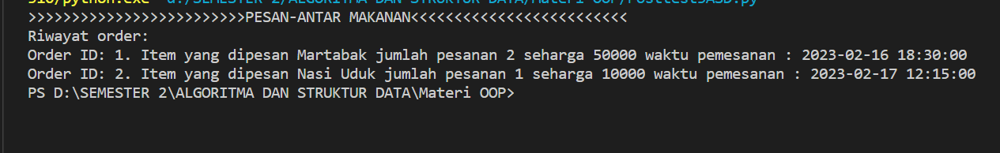
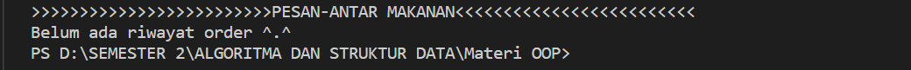

# Posttest-3-ASD

# CARA KERJA PROGRAM
Saat program dijalankan, pada class “OrderHistory()” mempresentasikan sebuah linked list. Class ini membuat linked list kosong dengan menginialisasi atribuat “head” menjadi “None”. Kemudian pada method “add_order” yang akan menambahkan simpul baru dan ditempatkan diakhir linked list. Method “show_orders”, digunkan untuk menampilkan output dari program yaitu ketika “order == 0” maka output dari program yaitu “Belum ada Riwayat order”, jika “order > 0” maka output dari program akan nenampilkan riwayat pesanan pengguna. Lalu method “get_orders” memiliki dua parameter yaitu “size_halaman” yang digunakan untuk menunjukkan jumlah riwayat order dalam satu halaman, “nomor_halaman” digunakan untuk menunjukkan nomor halaman yang akan ditampilkan.

# FUNGSIONALITAS PROGRAM
Fungsi dari singly linked list pada program adalah untuk merekam atau menyimpan riwayat pesanan dari setiap pengguna menggunakannya. Informasi yang ditampilkan berupa order id, nama item yang dipesan, lalu jumlah item yang dipesan, harga item dan waktu pemesanan item.   

# OUTPUT PROGRAM
1.	Memiliki riwayat pemesanan

2.	Tidak Memiliki riwayat pemesanan

 
# ELEMEN PADA PROGRAM
1.	Def atau Fungsi, digunakan untuk mengefisienkan suatu program serta memudahkan seorang programmer dalam menjalankan programnya. 
2.	Def __init__ , merupakan method yang pertama kali dijalankan sebelum method yang lainnya. Method ini digunakan untuk melakukan inisialisasi pembuatan objek dari class
3.	Class, digunakan sebagai wadah untuk menampung isi dari program yang akan dijalankan, didalamnya berisi method dan atribut untuk menjalankan suatu program.
4.	For, digunakan untuk mengulang suatu proses yang telah diketahui jumlahnya.  
5.	If else elif, suatu percabangan yang digunakan untuk memilih dari penyelesaian alternatif dari penyeleksian untuk mencari kondisi yang diinginkan.
6.	Return, digunakan untuk keluar dari fungsi dan kembali ke baris selanjutnya dimana fungsi dipanggil. 
